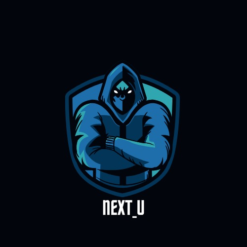

<p align="center">
  
</p>

<h1 align="center">🚀 Welcome to <span style="color:#6366F1">Next_U</span> - Become the Main Character in Your Life's Adventure</h1>

---

<div style="width: 280px; text-align: center;">
        
    </div>
    
---

# Project Presentation/Demo Video

[**tap here**](https://nextu.my.canva.site/) to view the full project presentation.

[**tap here**](https://nextu.my.canva.site/) to watch project demonstration video( DEMO video ).

[**tap here**](https://nextu.my.canva.site/) to see the deployed project.


---

## 📚 Table of Contents
- [🌟 Vision](#vision)
- [✍️ Project Description](#project-description)
- [📝 Proposed System](#proposed-system)
- [✨ Key Features](#key-features)
- [🌐 Interface Preview](#interface-preview)
  - [1. Landing Page](#1-landing-page)
  - [2. Web3 Login Feature](#2-web3-login-feature)
  - [3. Home Page](#3-home-page)
  - [4. Quest Page](#4-quest-page)
  - [5. Profile Page](#5-profile-page)
  - [6. Settings Page](#6-settings-page)
- [💻 Tech Stack](#tech-stack)
- [📱 App Structure](#app-structure)
- [⛔ Existing System and Drawbacks](#existing-system-and-drawbacks)
- [🚦 Getting Started](#getting-started)
- [🔄 Typical User Flow](#typical-user-flow)
- [📞 Contact](#contact)

---

## <a id="vision"></a>🌟 Vision

Next_U revolutionizes personal development by merging real-life achievements with an immersive gaming experience.

Unlike conventional habit trackers or productivity apps, **Next_U** creates a dynamic RPG environment where your real-life efforts directly power your in-game character.

✅ Physical fitness  
✅ Mental wellbeing  
✅ Learning new skills  
✅ Social challenges

Your actions earn XP, achievements, and leaderboard rankings.  
**Next_U** transforms mundane self-improvement into an engaging, gamified adventure!

<p align="right"><a href="#-table-of-contents">🔝 Back to Top</a></p>

---

## <a id="project-description"></a>✍️ Project Description

Next_U is a gamified personal growth app that turns your real-life self-improvement into an RPG adventure. Our platform tackles the common problem of abandoned habit trackers and fitness apps by making personal development genuinely fun. Instead of boring checklists, we've built a gaming experience where completing real-world challenges (like workouts, meditation, or learning) levels up your character, unlocks achievements, and puts you on leaderboards.

<p align="right"><a href="#-table-of-contents">🔝 Back to Top</a></p>

---

## <a id="proposed-system"></a>📝 Proposed System
We're developing a web app that connects your daily activities to in-game progress through several key components:

- Quest system offering daily personalized challenges across fitness, mindfulness, learning, and social areas
- XP-based progression system with levels, achievements, and badges
- User-created custom challenges for personal goal tracking
- Community features including leaderboards and friend competitions
- Verification through a mix of self-reporting, app integrations, and optional blockchain verification
- AI recommendation engine that learns user preferences and suggests new quests

<p align="right"><a href="#-table-of-contents">🔝 Back to Top</a></p>

---


## <a id="key-features"></a>✨ Key Features

### 🗓️ Core Experience
- ✅ **Daily Quests & Challenges** – Get personalized tasks in fitness, mindfulness, learning, etc.
- 🌟 **Experience Points (XP) System** – Complete tasks and level up your profile.
- ✍️ **Custom Quest Creation** – Tailor quests to fit your personal goals.
- 🏆 **Achievement Badges** – Celebrate milestones and consistency.
- 🥇 **Leaderboard** – Compete with friends or the community.

### 🤖 Advanced Features
- 🤯 **AI-Powered Recommendations** – Smart quest suggestions based on your habits.
- 📊 **Progress Analytics** – Visual dashboards of your development.
- 🔐 **Blockchain Integration** – Optional privacy-focused achievement verification.
- 🔥 **Streak Tracking** – Track consistency and stay motivated.

<p align="right"><a href="#-table-of-contents">🔝 Back to Top</a></p>

---

## <a id="interface-preview"></a>Interface Preview

### <a id="1-landing-page"></a>1. Landing Page

<div style="display: flex; flex-wrap: wrap; gap: 20px; justify-content: center; margin: 30px 0;">
    <div style="width: 200px; text-align: center;">
        
        <p style="margin: 8px 0 0; font-size: 13px; text-align: right;">Landing Page</p>
    </div>
    <div style="width: 200px; text-align: center;">
        
        <p style="margin: 8px 0 0; font-size: 13px; text-align: center;">Key Features</p>
    </div>
    <div style="width: 200px; text-align: center;">
        
        <p style="margin: 8px 0 0; font-size: 13px; text-align: center;">Get Started</p>
    </div>
</div>

---

### <a id="2-web3-login-feature"></a>2. Web3 Login Feature

<div style="display: flex; flex-wrap: wrap; gap: 20px; justify-content: center; margin: 30px 0;">
    <div style="width: 200px; text-align: center;">
        
        <p style="margin: 8px 0 0; font-size: 13px; text-align: center;">Login Screen</p>
    </div>
    <div style="width: 200px; text-align: center;">
        
        <p style="margin: 8px 0 0; font-size: 13px; text-align: center;">Wallet Connection</p>
    </div>
    <div style="width: 200px; text-align: center;">
        
        <p style="margin: 8px 0 0; font-size: 13px; text-align: center;">Successful Login</p>
    </div>
</div>

---

### <a id="3-home-page"></a>3. Home Page

<div style="display: flex; flex-wrap: wrap; gap: 20px; justify-content: center; margin: 30px 0;">
    <div style="width: 200px; text-align: center;">
        
        <p style="margin: 8px 0 0; font-size: 13px; text-align: center;">Home Page</p>
    </div>
    <div style="width: 200px; text-align: center;">
        
        <p style="margin: 8px 0 0; font-size: 13px; text-align: center;">Begin Journey</p>
    </div>
    <div style="width: 200px; text-align: center;">
        
        <p style="margin: 8px 0 0; font-size: 13px; text-align: center;">Level Up</p>
    </div>
    <div style="width: 200px; text-align: center;">
        
        <p style="margin: 8px 0 0; font-size: 13px; text-align: center;">Quest Info</p>
    </div>
</div>

---

### <a id="4-quest-page"></a>4. Quest Page

<div style="display: flex; flex-wrap: wrap; gap: 20px; justify-content: center; margin: 30px 0;">
    <div style="width: 200px; text-align: center;">
        
        <p style="margin: 8px 0 0; font-size: 13px; text-align: center;">Completing Quest</p>
    </div>
    <div style="width: 200px; text-align: center;">
        
        <p style="margin: 8px 0 0; font-size: 13px; text-align: center;">Custom Quests</p>
    </div>
    <div style="width: 200px; text-align: center;">
        
        <p style="margin: 8px 0 0; font-size: 13px; text-align: center;">Leaderboard</p>
    </div>
</div>

---

### <a id="5-profile-page"></a>5. Profile Page

<div style="display: flex; flex-wrap: wrap; gap: 20px; justify-content: center; margin: 30px 0;">
    <div style="width: 200px; text-align: center;">
        
        <p style="margin: 8px 0 0; font-size: 13px; text-align: center;">Profile Overview</p>
    </div>
    <div style="width: 200px; text-align: center;">
        
        <p style="margin: 8px 0 0; font-size: 13px; text-align: center;">Detailed Profile</p>
    </div>
</div>

---

### <a id="6-settings-page"></a>6. Settings Page

<div style="display: flex; flex-wrap: wrap; gap: 20px; justify-content: center; margin: 30px 0;">
    <div style="width: 200px; text-align: center;">
        
        <p style="margin: 8px 0 0; font-size: 13px; text-align: center;">Settings Page</p>
    </div>
    <div style="width: 200px; text-align: center;">
        
        <p style="margin: 8px 0 0; font-size: 13px; text-align: center;">Security Guard</p>
    </div>
</div>

---

## <a id="tech-stack"></a>💻 Tech Stack

<div align="center">
  
</div>

### 🧑‍💻 Frontend
- [](https://reactjs.org/)
- [](https://nextjs.org/)
- [](https://tailwindcss.com/)
- 💫 Real-time UX with interactive animations & transitions

### 🔧 Backend
- [](https://nodejs.org/)
- [](https://expressjs.com/)
- [](https://www.mongodb.com/)
- [](https://www.postgresql.org/)
- [](https://firebase.google.com/)
- 🔐 JWT / Firebase Authentication for secure user sessions

### 🧠 AI & Blockchain
- [](https://www.python.org/)
- [](https://www.tensorflow.org/)
- [](https://scikit-learn.org/)
- [](https://docs.soliditylang.org/)
- [](https://ethereum.org/)
- 📡 RESTful API Architecture with modular service structure

<p align="right"><a href="#-table-of-contents">🔝 Back to Top</a></p>

---


## <a id="app-structure"></a>📱 App Structure

```bash
├── /               # 🌐 Landing page
├── /login          # 🔐 Login page
├── /signup         # 📝 Registration
├── /dashboard      # 📊 User’s main hub
├── /quests         # 📋 Quests overview
│   └── /create     # ✍️ Custom quest builder
├── /profile        # 🧑 User profile & achievements
├── /leaderboard    # 🏆 Rankings
└── /settings       # ⚙️ Preferences
```
<p align="right"><a href="#-table-of-contents">🔝 Back to Top</a></p>

---

## <a id="existing-system-and-drawbacks"></a>⛔ Existing System and Drawbacks

Current habit trackers and productivity apps suffer from several key limitations:

- Low engagement - traditional trackers feel like chores, leading to high abandonment rates
- Lack of meaningful rewards - checkmarks and streaks aren't motivating enough long-term
- Single-focus approach - most apps track only fitness OR productivity OR learning, not a holistic view
- Limited customization - preset goals often don't match personal needs
- Minimal social features - existing apps rarely harness the power of community competition

  <p align="right"><a href="#-table-of-contents">🔝 Back to Top</a></p>

---

## <a id="getting-started"></a>🚦 Getting Started

### ***Clone repository*** <br>
```
git clone https://github.com/Queue4U-org/Next_U.git
```

### ***Install dependencies*** <br>
```
cd nextyou
npm install
```

### ***Configure environment*** <br>
```
cp .env.example .env.local
``` 

### ***Start development server*** <br>
```
npm run dev
```

### ***Build for production*** <br>
```
npm run build
```
<p align="right"><a href="#-table-of-contents">🔝 Back to Top</a></p>

---

## <a id="typical-user-flow"></a>🔄 Typical User Flow

1. 🧑‍💼 **User signs up and sets goals**  
   The journey begins by creating an account and sharing personal development preferences.

2. 🧠 **Receives quests based on preferences**  
   AI analyzes user input to suggest personalized daily challenges across fitness, learning, mindfulness, and more.

3. 🎯 **Completes tasks and earns XP**  
   Every completed task grants experience points (XP), contributing to the user’s level and profile growth.

4. 🧱 **Builds profile, unlocks badges**  
   Users level up, earn streaks, and unlock achievements as they maintain consistency.

5. 🔨 **Creates custom challenges**  
   Design your own goals and track your personal milestones with the custom quest builder.

6. 🧑‍🤝‍🧑 **Compares progress on the leaderboard**  
   Stay motivated by comparing your journey with friends or the global community via real-time rankings.

7. 🪙 **Optionally uses blockchain rewards**  
   Advanced users can link digital wallets to verify accomplishments and unlock premium quests through blockchain integration.

<p align="right"><a href="#-table-of-contents">🔝 Back to Top</a></p>

---

## <a id="contact"></a>📞 Contact
For support or inquiries, please contact us at - <br/></br>
nextu@gmail.com

<hr style="border-top: 0px solid #9CA3AF; width: 100%;" />
<p align="center">© 2025 NextYou - Become the Main Character in Your Life's Adventure</p>

<p align="right"><a href="#-table-of-contents">🔝 Back to Top</a></p>


