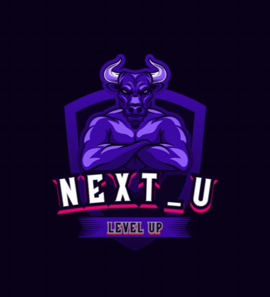

<p align="center">
  
</p>

<h1 align="center">🚀 Welcome to <span style="color:#6366F1">Next_U</span> - Level Up Your Life</h1>

---

## 📚 Table of Contents

- [🌟 Vision](#-vision)
- [✨ Key Features](#-key-features)
- [💻 Tech Stack](#-tech-stack)
- [📱 App Structure](#-app-structure)
- [🚦 Getting Started](#-getting-started)
- [🔄 Typical User Flow](#-typical-user-flow)
- [📞 Contact](#-contact)

---

## 🌟 Vision

Next_U revolutionizes personal development by merging real-life achievements with an immersive gaming experience.

Unlike conventional habit trackers or productivity apps, **Next_U** creates a dynamic RPG environment where your real-life efforts directly power your in-game character.

✅ Physical fitness  
✅ Mental wellbeing  
✅ Learning new skills  
✅ Social challenges

Your actions earn XP, achievements, and leaderboard rankings.  
**Next_U** transforms mundane self-improvement into an engaging, gamified adventure!

<p align="right"><a href="#-table-of-contents">🔝 Back to Top</a></p>

---

## ✨ Key Features

### 🗓️ Core Experience
- ✅ **Daily Quests & Challenges** – Get personalized tasks in fitness, mindfulness, learning, etc.
- 🌟 **Experience Points (XP) System** – Complete tasks and level up your profile.
- ✍️ **Custom Quest Creation** – Tailor quests to fit your personal goals.
- 🏆 **Achievement Badges** – Celebrate milestones and consistency.
- 🥇 **Leaderboard** – Compete with friends or the community.

### 🤖 Advanced Features
- 🤯 **AI-Powered Recommendations** – Smart quest suggestions based on your habits.
- 📊 **Progress Analytics** – Visual dashboards of your development.
- 🔐 **Blockchain Integration** – Optional privacy-focused achievement verification.
- 🔥 **Streak Tracking** – Track consistency and stay motivated.

<p align="right"><a href="#-table-of-contents">🔝 Back to Top</a></p>

---

## 💻 Tech Stack

### 🧑‍💻 Frontend
- [](https://reactjs.org/)
- [](https://nextjs.org/)
- [](https://tailwindcss.com/)
- 💫 Real-time UX with interactive animations & transitions

### 🔧 Backend
- [](https://nodejs.org/)
- [](https://expressjs.com/)
- [](https://www.mongodb.com/)
- [](https://www.postgresql.org/)
- [](https://firebase.google.com/)
- 🔐 JWT / Firebase Authentication for secure user sessions

### 🧠 AI & Blockchain
- [](https://www.python.org/)
- [](https://www.tensorflow.org/)
- [](https://scikit-learn.org/)
- [](https://docs.soliditylang.org/)
- [](https://ethereum.org/)
- 📡 RESTful API Architecture with modular service structure

<p align="right"><a href="#-table-of-contents">🔝 Back to Top</a></p>

---


## 📱 App Structure

```bash
├── /               # 🌐 Landing page
├── /login          # 🔐 Login page
├── /signup         # 📝 Registration
├── /dashboard      # 📊 User’s main hub
├── /quests         # 📋 Quests overview
│   └── /create     # ✍️ Custom quest builder
├── /profile        # 🧑 User profile & achievements
├── /leaderboard    # 🏆 Rankings
└── /settings       # ⚙️ Preferences
```
<p align="right"><a href="#-table-of-contents">🔝 Back to Top</a></p>

---

## 🚦 Getting Started

### ***Clone repository*** <br>
```
git clone https://github.com/Queue4U-org/Next_U.git
```

### ***Install dependencies*** <br>
```
cd nextyou
npm install
```

### ***Configure environment*** <br>
```
cp .env.example .env.local
``` 

### ***Start development server*** <br>
```
npm run dev
```

### ***Build for production*** <br>
```
npm run build
```
<p align="right"><a href="#-table-of-contents">🔝 Back to Top</a></p>

---

## 🔄 Typical User Flow

1. 🧑‍💼 **User signs up and sets goals**  
   The journey begins by creating an account and sharing personal development preferences.

2. 🧠 **Receives quests based on preferences**  
   AI analyzes user input to suggest personalized daily challenges across fitness, learning, mindfulness, and more.

3. 🎯 **Completes tasks and earns XP**  
   Every completed task grants experience points (XP), contributing to the user’s level and profile growth.

4. 🧱 **Builds profile, unlocks badges**  
   Users level up, earn streaks, and unlock achievements as they maintain consistency.

5. 🔨 **Creates custom challenges**  
   Design your own goals and track your personal milestones with the custom quest builder.

6. 🧑‍🤝‍🧑 **Compares progress on the leaderboard**  
   Stay motivated by comparing your journey with friends or the global community via real-time rankings.

7. 🪙 **Optionally uses blockchain rewards**  
   Advanced users can link digital wallets to verify accomplishments and unlock premium quests through blockchain integration.

<p align="right"><a href="#-table-of-contents">🔝 Back to Top</a></p>

---

## 📞 Contact
For support or inquiries, please contact us at - <br/></br>
nextu@gmail.com

<hr style="border-top: 0px solid #9CA3AF; width: 100%;" />
<p align="center">© 2025 NextYou - Level Up Your Life</p>

<p align="right"><a href="#-table-of-contents">🔝 Back to Top</a></p>


